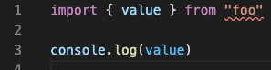
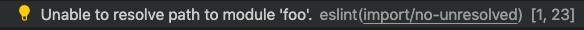

# importmap-eslint-resolver

Import maps resolution for ESLint.

[](https://github.com/jsenv/jsenv-importmap-eslint-resolver/packages)
[](https://www.npmjs.com/package/@jsenv/importmap-eslint-resolver)
[](https://github.com/jsenv/jsenv-importmap-eslint-resolver/actions?workflow=ci)
[](https://codecov.io/gh/jsenv/jsenv-importmap-eslint-resolver)

# Table of contents

- [Presentation](#Presentation)
- [Installation](#installation)
- [Set importmap file path](#Set-importmap-file-path)
- [Case sensitivity](#Case-sensitivity)
- [Node core modules](#Node-core-modules)
- [Extensionless import](#extensionless-import)
- [Bare specifier](#Bare-specifier)

# Presentation

Import maps are used to remap import to somewhere else. For instance the following importmap allows to remap `"foo"` to `"./foo.js"`.

```json
{
  "imports": {
    "foo": "./foo.js"
  }
}
```

By providing this importmap to the browser or Node.js, js imports resolution becomes aware of the importmap file remappings. You can write the following js file and it would search for file at `"./foo.js"`.

```js
import { value } from "foo"

console.log(value)
```

If you use `import/no-unresolved` rule from `eslint-plugin-import` these imports are reported as not resolved as shown in images below.

</br >


This is why `@jsenv/importmap-eslint-resolver` exists: to make `import/no-unresolved` compatible with importmap file.

— see [ESLint website](https://eslint.org)<br />
— see [eslint-plugin-import on github](https://github.com/benmosher/eslint-plugin-import)<br />
— see [importmap spec on github](https://github.com/WICG/import-maps)<br />

# Installation

Follow the steps below to enable importmap resolution for ESLint.

<details>
  <summary>Install eslint-plugin-import</summary>

> If you already use this ESLint plugin you can skip this step.

```console
npm install --save-dev eslint-plugin-import
```

</details>

<details>
  <summary>Install importmap-eslint-resolver</summary>

```console
npm install --save-dev @jsenv/importmap-eslint-resolver
```

</details>

<details>
  <summary>Configure ESLint</summary>

Your ESLint config must:

- enable `eslint-plugin-import` in `plugins`
- configure `eslint-plugin-import` to use `@jsenv/importmap-eslint-resolver` as resolver

Your minimal `.eslintrc.cjs` file looks like this:

```js
module.exports = {
  plugins: ["import"],
  settings: {
    "import/resolver": {
      [require.resolve("@jsenv/importmap-eslint-resolver")]: {
        projectDirectoryUrl: __dirname,
      },
    },
  },
}
```

</details>

# Set importmap file path

By default we will search for a file in your project directory named `import-map.importmap`. If the importmap file is located somewhere else you can use `importMapFileRelativeUrl` parameter to tell us where to look at.

<details>
  <summary>See ESLint config where importmap path is used</summary>

```js
module.exports = {
  plugins: ["import"],
  settings: {
    "import/resolver": {
      [require.resolve("@jsenv/importmap-eslint-resolver")]: {
        projectDirectoryUrl: __dirname,
        importMapFileRelativeUrl: "./project.importmap",
      },
    },
  },
}
```

</details>

# Case sensitivity

This resolver is case sensitive by default: An import is found only if the import path and actual file on the filesystem have same case.

```js
import { getUser } "./getUser.js"
```

The import above is found only if there is a file `getUser.js`. It won't be found if file is named `getuser.js`, even if the filesystem is case insensitive.

This ensure two things:

- Project is compatible with Windows or other operating system where filesystem is case sensitive.
- import paths are consistent with what is actually on the filesystem

Case sensitivity can be disabled using `caseSensitive: false`

<details>
<summary>See ESLint config where case sensitivity is disabled
</summary>

```js
module.exports = {
  plugins: ["import"],
  settings: {
    "import/resolver": {
      [require.resolve("@jsenv/importmap-eslint-resolver")]: {
        projectDirectoryUrl: __dirname,
        caseSensitive: false,
      },
    },
  },
}
```

</details>

# Node core modules

This resolver consider files are written for browsers by default: Node core modules will be considered as not found.

```js
import { readFile } from "fs"
```

The import would be reported by ESLint as not resolved. You can pass `node: true` in ESLint config and node core modules will be handled gracefully.

<details>
<summary>See ESLint config where node is enabled
</summary>

```js
module.exports = {
  plugins: ["import"],
  settings: {
    "import/resolver": {
      [require.resolve("@jsenv/importmap-eslint-resolver")]: {
        projectDirectoryUrl: __dirname,
        node: true,
      },
    },
  },
}
```

</details>

# Extensionless import

Extensionless import means an import where the specifier omits the file extension.

```js
import { value } from "./file"
```

But these type of specifier are problematic: you don't know where to look at for the corresponding file.

- Is it `./file` ?
- Is it `./file.js` ?
- Is it `./file.ts` ?

The best solution to avoid configuring your brain and your browser is to keep the extension on the specifier.

```diff
- import { value } from './file'
+ import { value } from './file.js'
```

But if for some reason this is problematic you can still configure `@jsenv/importmap-eslint-resolver` to understand these extensionless specifiers using `defaultExtension`.

By passing `defaultExtension: true` you tell `@jsenv/importmap-eslint-resolver` to automatically add the importer extension when its omitted.

```js
import { value } from "./file"
```

If written in `index.js`, searches file at `file.js`.<br />
If written in `index.ts`, searches file at `file.ts`.

<details>
<summary>See ESLint config where default extension is enabled
</summary>

```js
module.exports = {
  plugins: ["import"],
  settings: {
    "import/resolver": {
      [require.resolve("@jsenv/importmap-eslint-resolver")]: {
        projectDirectoryUrl: __dirname,
        defaultExtension: true,
      },
    },
  },
}
```

</details>

# Bare specifier

A specifier is what is written after the from keyword in an import statement.

```js
import value from "specifier"
```

If there is no mapping of `"specifier"` to `"./specifier.js"` the imported file will not be found.
This is because import map consider `"specifier"` as a special kind of specifier called bare specifier.
And every bare specifier must have a mapping or it cannot be resolved.
To fix this either add a mapping or put explicitely `"./specifier.js"`.

Please note that `"specifier.js"` is also a bare specifier. You should write `"./specifier.js"` instead.
